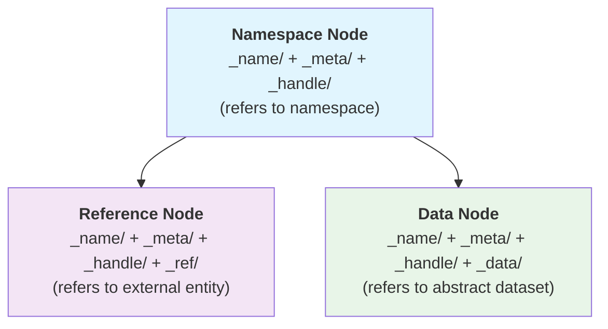

## Overview

The primary constituents of a semantic mesh are **mesh nodes**. They are physically represented as [[mesh folders|sflo.concept.mesh.resource.folder]] and they correspond to [[namespace segments|sflo.concept.namespace.segment]].

Mesh nodes are extensible namespace containers that can contain other mesh nodes and [[mesh elements|sflo.concept.mesh.resource.element]], distinguishing them from elements which are terminal within their own scope.

## Physical Structure

When stored on disk, all mesh nodes:
- Are physically represented as folders in the filesystem
- Have folder names that become namespace segments
- Extend the URL namespace with their folder name
- Can be further extended by containing other mesh resources

## Mandatory Elements

Every mesh node has these elements:

- **[[sflo.concept.mesh.resource.element.name-dataset]]** (`_name/`) : Contains the node's identity and naming information
- **[[sflo.concept.mesh.resource.element.meta-dataset]]** (`_meta/`): Centralized metadata for the node
- **[[sflo.concept.mesh.resource.element.node-handle]]** (`_handle/`): Universal marker folder that refers to the parent "as a mesh node", as opposed to "as the name, dataset, or other thing" to which it normally refers; a handle resource page should explain this distinction

## Exclusive Elements

A node may have one but not both of these:

- **[[sflo.concept.mesh.resource.element.reference-dataset]]** (`_ref/`) : Reference data for external entity representation
- **[[sflo.concept.mesh.resource.element.data-dataset]]** (`_data/`) : Dataset content and distributions

## Node Types

### 1. [[Namespace Node|sflo.concept.mesh.resource.node.namespace]]
**Elements**: `_name/` + `_meta/` + `_handle/`
- Functions as organizational containers
- Contains essential identity, metadata, and handle information
- Node IRI refers to the namespace itself
- Base level for all mesh nodes

### 2. [[Reference Node|sflo.concept.mesh.resource.node.reference]]
**Elements**: `_name/` + `_meta/` + `_handle/` + `_ref/`
- Represents external entities (people, concepts, relationships)
- Node IRI refers to the external entity being referenced
- Adds reference data capabilities to the namespace foundation
- Evolved from namespace nodes by adding the `_ref/` element
- Maintains single referent principle - the node refers to the external entity

### 3. [[Data Node|sflo.concept.mesh.resource.node.data]]
**Elements**: `_name/` + `_meta/` + `_handle/` + `_data/`
- Contains data distributions and versioning capabilities
- Node IRI refers to the abstract dataset
- Adds dataset storage to the namespace foundation
- Can be configured as [[dataset series|sflo.concept.mesh.resource.node.data.series]]
- Evolved from namespace nodes by adding the `_data/` element
- Maintains single referent principle - the node refers to the dataset

## Node Evolution Path

Mesh nodes follow a simplified three-node evolutionary architecture that preserves the single referent principle. All nodes begin with a universal structure and can evolve by adding optional elements to support different use cases while maintaining a single, clear referent.

