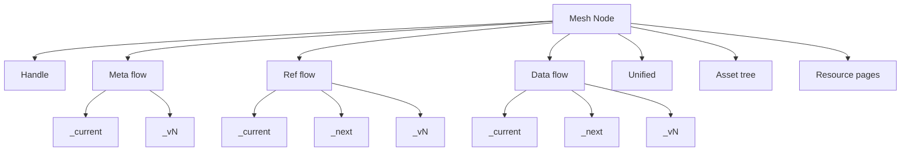

# Semantic Mesh — Brief for LLMs

Twin Pillars of the Semantic Flow methodology
- minting IRIs for referring to things on the semantic web
- storing semantic data and datasets that use those IRIs.

Definition
- A semantic mesh is a dereferenceable, folder-structured, possibly-versioned corpus of semantic resources where every URL returns meaningful content. It maps directly from a Git repository to a static site so that:
  - every resource is addressable;
  - folder resources are dereferenceable via index.html;
  - RDF datasets evolve through versioned snapshots;
  - a weave process maintains integrity.
  - See [concept.mesh.md](concept.mesh.md).

Design Principles
- Dereferenceability for humans — [principle.dereferencability-for-humans.md](principle.dereferencability-for-humans.md): folder URLs return meaningful HTML.
- Single referent — [principle.single-referent.md](principle.single-referent.md): each URL identifies exactly one thing (concept vs content are distinct).
- Pseudo-immutability — [principle.pseudo-immutability.md](principle.pseudo-immutability.md): treat version snapshots and identifiers as immutable.
- Transposability and composability — [concept.transposability.md](concept.transposability.md), [concept.composability.md](concept.composability.md): meshes move or compose cleanly via relative links and weaving.

Core Model
- Mesh resources split into Nodes and Elements — [concept.mesh.resource.md](concept.mesh.resource.md).
- Nodes (extensible folders):
  - Namespace node — [concept.mesh.resource.node.namespace.md](concept.mesh.resource.node.namespace.md): organizer.
  - Reference node — [concept.mesh.resource.node.reference.md](concept.mesh.resource.node.reference.md): identifies an external entity; has reference data.
  - Data node — [concept.mesh.resource.node.data.md](concept.mesh.resource.node.data.md): identifies the concept of a dataset; content lives in data flow snapshots.
  - Dataset-series node — [concept.mesh.resource.node.data.series.md](concept.mesh.resource.node.data.series.md): optional specialization.
- Elements (terminal):
  - Flows (abstract DatasetSeries): [concept.mesh.resource.element.flow.md](concept.mesh.resource.element.flow.md), [concept.mesh.resource.element.flow.metadata.md](concept.mesh.resource.element.flow.metadata.md), [concept.mesh.resource.element.flow.reference.md](concept.mesh.resource.element.flow.reference.md), [concept.mesh.resource.element.flow.data.md](concept.mesh.resource.element.flow.data.md), [concept.mesh.resource.element.flow.unified.md](concept.mesh.resource.element.flow.unified.md).
  - Flow snapshots (concrete Datasets): [concept.mesh.resource.element.flow.snapshot.md](concept.mesh.resource.element.flow.snapshot.md), [concept.mesh.resource.element.flow.snapshot.current.md](concept.mesh.resource.element.flow.snapshot.current.md), [concept.mesh.resource.element.flow.snapshot.next.md](concept.mesh.resource.element.flow.snapshot.next.md), [concept.mesh.resource.element.flow.snapshot.version.md](concept.mesh.resource.element.flow.snapshot.version.md), [concept.mesh.resource.element.flow.snapshot.distribution.md](concept.mesh.resource.element.flow.snapshot.distribution.md).
  - Handle — [concept.mesh.resource.element.handle.md](concept.mesh.resource.element.handle.md), [concept.mesh.resource.element.handle.page.md](concept.mesh.resource.element.handle.page.md): refer to a node “as a mesh resource”.
  - Documentation — [concept.mesh.resource.element.documentation-resource.readme.md](concept.mesh.resource.element.documentation-resource.readme.md), [concept.mesh.resource.element.documentation-resource.changelog.md](concept.mesh.resource.element.documentation-resource.changelog.md), [concept.mesh.resource.element.documentation-resource.resource-page.md](concept.mesh.resource.element.documentation-resource.resource-page.md), [concept.mesh.resource.element.documentation-resource.resource-fragment.md](concept.mesh.resource.element.documentation-resource.resource-fragment.md).
  - Asset tree — [concept.mesh.resource.element.asset-tree.md](concept.mesh.resource.element.asset-tree.md): attached static files.
  - Aggregated distribution — [concept.mesh.resource.element.aggregated-distribution.md](concept.mesh.resource.element.aggregated-distribution.md): roll-up of child data.

Addressing and Identity
- Folders become namespace segments and URL path components — [concept.mesh.resource-facet.folder.md](concept.mesh.resource-facet.folder.md), [concept.namespace.segment.md](concept.namespace.segment.md).
- Relative identifiers resolve from the distribution’s location — [concept.relative-identifier.md](concept.relative-identifier.md).
- URL semantics — [concept.url.md](concept.url.md), [concept.url.reference-path-choices.md](concept.url.reference-path-choices.md):
  - Concept URLs (slash-terminated) identify entities/abstract constructs (nodes, abstract datasets, snapshots, handle).
  - Content URLs (file extensions) identify retrievable representations (distributions, index.html, README.md, assets).

Lifecycle and Versioning
- Only flows (DatasetSeries) are versioned; nodes are not — [concept.versioning.md](concept.versioning.md).
- Snapshots:
  - _current: stable, identical to latest _vN post-weave.
  - _next: mutable workspace (usually one working distribution) — [concept.working-distribution.md](concept.working-distribution.md).
  - _vN: immutable for citation/provenance.
- Weave process — [concept.weave-process.md](concept.weave-process.md): creates version snapshots, promotes _next → _current, updates meta, regenerates resource pages, rebuilds unified datasets.
- Provenance — [concept.metadata.provenance.md](concept.metadata.provenance.md): captured in meta flows with stable fragment IRIs and delegation chains; _current meta mirrors latest version.

Publishing and Transposition
- Mesh repos publish as static sites; folder paths map to URLs — [concept.mesh-repo.md](concept.mesh-repo.md), [concept.semantic-site.md](concept.semantic-site.md), [concept.publication.md](concept.publication.md).
- Transposability: relative links and no hardcoded BASE allow moving meshes across domains — [concept.transposability.md](concept.transposability.md).

Configuration and Inheritance
- Node configuration controls versioning, distributions, page/fragment generation, unified/aggregated behavior, rights defaults — [concept.node-config.md](concept.node-config.md).
- Optional per-node config component plus inherited defaults (ancestors/service/platform), “most specific wins”, explicit inheritance firewalls — [concept.mesh.resource.element.flow.config.md](concept.mesh.resource.element.flow.config.md), [concept.mesh.resource.element.node-config-defaults.md](concept.mesh.resource.element.node-config-defaults.md), [concept.mesh.resource.element.flow.config.inheritance.md](concept.mesh.resource.element.flow.config.inheritance.md).

Unified and Aggregated Views
- Unified dataset — [concept.mesh.resource.element.flow.unified.md](concept.mesh.resource.element.flow.unified.md): system-generated, versioned aggregation of a node’s non-config flows for one-shot access.
- Aggregated distribution — [concept.mesh.resource.element.aggregated-distribution.md](concept.mesh.resource.element.aggregated-distribution.md): optional roll-up of contained nodes’ current data at a parent node.

Mermaid Overview

Minimal Example
- [concept.semantic-mesh.example.md](concept.semantic-mesh.example.md).
/