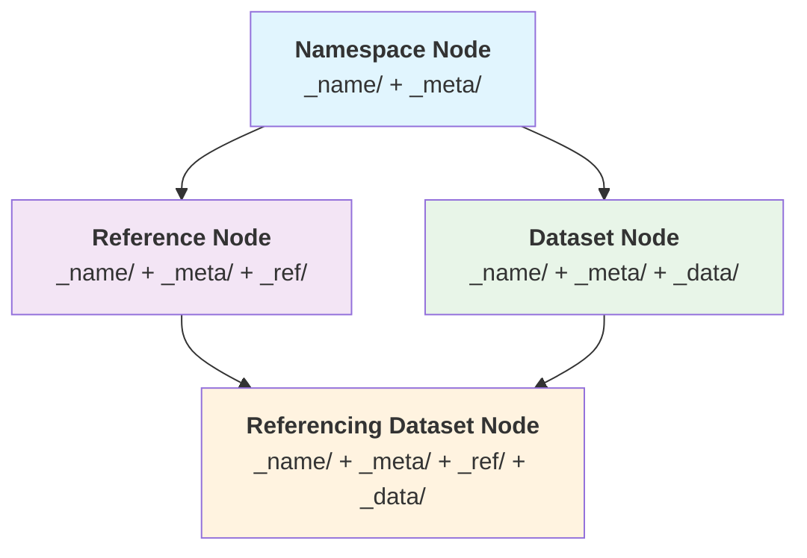

## Overview

The primary constituents of a semantic mesh are **mesh nodes**. They are physically represented as [[mesh folders|sflow.concept.mesh.resource.folder]] and they correspond to [[namespace segments|sflow.concept.namespace.segment]].

Mesh nodes are extensible namespace containers that can contain other mesh nodes and [[mesh elements|sflow.concept.mesh.resource.element]], distinguishing them from elements which are terminal within their own scope.

## Physical Structure

All mesh nodes:
- Are physically represented as folders in the filesystem
- Have folder names that become namespace segments
- Extend the URL namespace with their folder name
- Can be further extended by containing other mesh resources
- 
## Core Facets

Every mesh node is built from these facets:

- **`_name/`** (mandatory): Contains the node's identity and naming information
- **`_meta/`** (mandatory): Centralized metadata for the node
- **`_ref/`** (optional): Reference data for external entity representation
- **`_data/`** (optional): Dataset content and distributions

## Node Types

### 1. Namespace Node
**Defining Facets**: `_name/` + `_meta/`
- Functions as organizational containers
- Contains only essential identity and metadata
- Can contain other mesh nodes

### 2. Reference Node
**Defining Facets**: `_name/` + `_meta/` + `_ref/`
- Represents external entities (people, concepts, relationships)
- Adds reference data capabilities to the namespace foundation
- Can contain other mesh nodes in addition to reference data
- Evolved from namespace nodes by adding the `_ref/` facet

### 3. Dataset Node
**Defining Facets**: `_name/` + `_meta/` + `_data/`
- Contains data distributions and versioning capabilities
- Adds dataset storage to the namespace foundation
- May contain other mesh nodes
- Can be configured as [[dataset series|sflow.concept.mesh.resource.node.data.series]]
- Evolved from namespace nodes by adding the `_data/` facet

### 4. Referencing Dataset Node
**Defining Facets**: `_name/` + `_meta/` + `_ref/` + `_data/`
- Combines all facets for maximum capability
- Represents external entities while also containing datasets
- The most complete form of mesh node
- Can evolve from either reference nodes (by adding `_data/`) or dataset nodes (by adding `_ref/`)

## Physical Structure

All mesh nodes:
- Are physically represented as folders in the filesystem
- Have folder names that become namespace segments
- Extend the URL namespace with their folder name
- Can be further extended by containing other mesh resources
- 
## Node Evolution Path

Mesh nodes follow a four-facet evolutionary architecture where nodes progressively acquire capabilities through the addition of facets via corresponding datasets. All nodes begin with a basic foundation and can evolve by adding optional facets to support different use cases.

## Common Elements

Every mesh node contains:
- A [[node handle|sflow.concept.mesh.resource.element.node-handle]] at `_handle/index.html` for referential indirection
- Centralized metadata in the `_meta/` facet for administrative information
- Name data, including 
- Optional additional facets (`_ref/`, `_data/`) depending on the node's evolutionary path